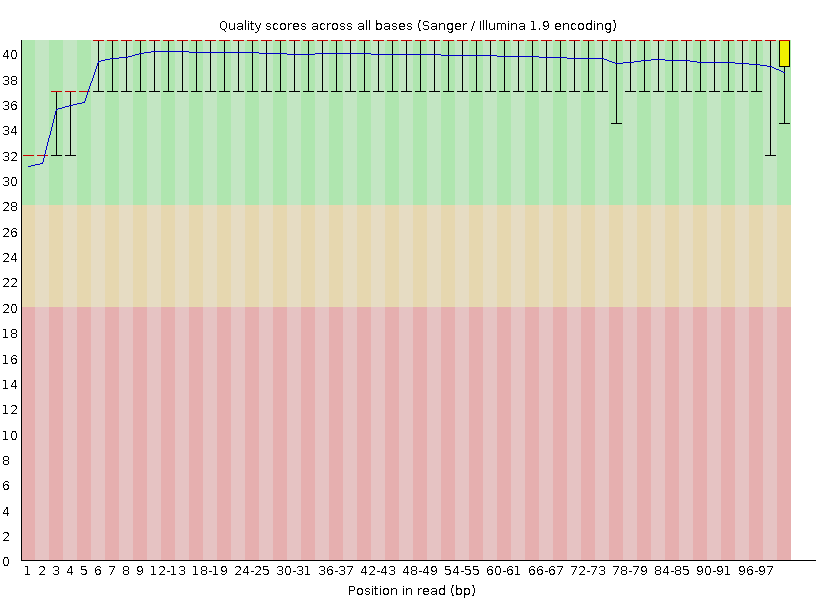
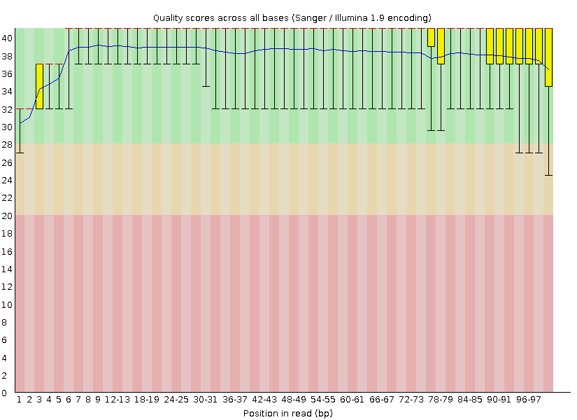
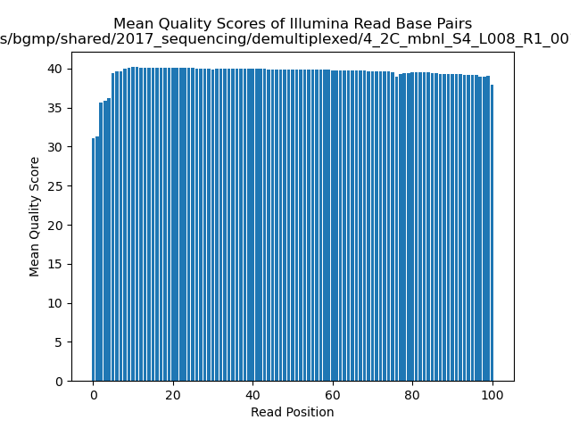
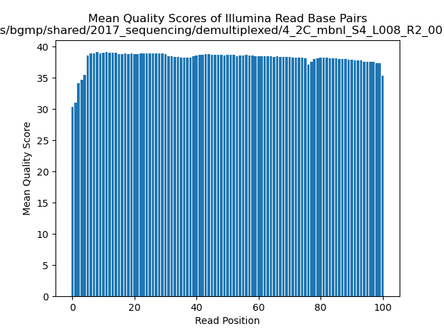
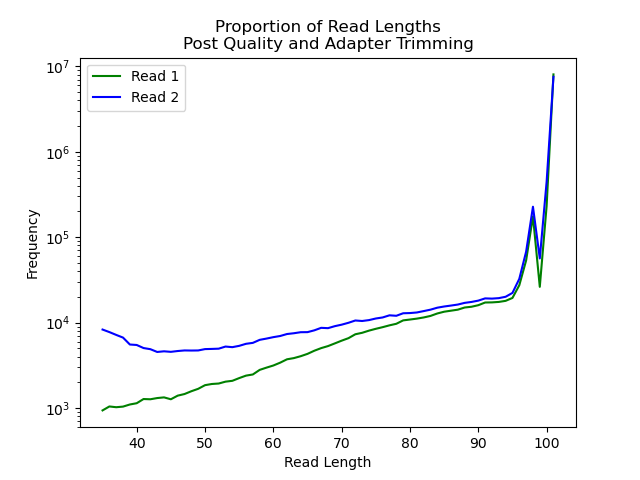

```{r setup, include=FALSE, message = FALSE, warning=FALSE}
knitr::opts_chunk$set(echo = FALSE)
library(tidyverse) 
```

# Only 1 set of files was given for analysis
Kaitlyn L       4_2C_mbnl_S4_L008       4_2C_mbnl_S4_L008

## Part 1 - Read quality score distributions
### FastQC Results

1. Using FastQC via the command line on Talapas, produce plots of quality score distributions for R1 and R2 reads. Also, produce plots of the per-base N content, and comment on whether or not they are consistent with the quality score plots.

```{r out.width="80%", fig.align="center", fig.cap="Fig 1. Per Base N Content of R1 from FastQC"}
knitr::include_graphics("fastqc_results/4_2C_mbnl_S4_L008_R1_001_fastqc/Images/per_base_n_content.png")
```

```{r out.width="80%", fig.align="center", fig.cap="Fig 2. Per Base Quality of R1 from FastQC"}

```

```{r out.width="80%", fig.align="center", fig.cap="Fig 3. Per Base N Content of R2 from FastQC"}
knitr::include_graphics("fastqc_results/4_2C_mbnl_S4_L008_R2_001_fastqc/Images/per_base_n_content.png")
```

```{r out.width="80%", fig.align="center", fig.cap="Fig 4. Per Base Quality of R2 from FastQC"}

```

For R1, the first several reads have a lower base quality than the rest of the reads, which is also reflected in a small lift of per base N content graph. The same goes for R2. For both R1 and R2, however, it seems as though the slight decrease in quality at the ends of the reads don't affect the per base N contents as much as they do at the start of reads. This may be due to the degradation of tail ends, from which the reads start, and the preservation of the middle portions, at which the reads end. The middle of the library is protected by the degrading ends. 

2. Run your quality score plotting script from your Demultiplexing assignment. (Make sure you're using the "running sum" strategy!!) Describe how the FastQC quality score distribution plots compare to your own. If different, propose an explanation. Also, does the runtime differ? If so, why?

```{r out.width="80%", fig.align="center", fig.cap="Fig 5. Python Calculated Per Base Quality of R1 from personal python script"}

```

```{r out.width="80%", fig.align="center", fig.cap="Fig 6. Python Calculated Per Base Quality of R2 from personal python script"}

```

The FastQC quality score distribution plots look fairly similar to the quality score plotting script from Demultiplexing. However, the runtimes are very different. For FastQC, the runtime was 1:49.78 (minutes:seconds), while for the Demux script, the runtime was 11:55.70. Overall, FastQC is much faster. 

3. Comment on the overall data quality of your two libraries.

The overall data quality of the library is good, considering the lowest average quality score found in both the FastQC and Demux plots was 30. This is expected because the first couple base pairs usually have a poor quality score, and the majority of the rest of the reads have much better quality scores. 

## Part 2 – Adaptor trimming comparison

5. Using cutadapt, properly trim adapter sequences from your assigned files. Be sure to read how to use cutadapt. Use default settings. What proportion of reads (both R1 and R2) were trimmed?  

Original files  

```{bash eval=FALSE, echo=TRUE}
$ zcat /projects/bgmp/shared/2017_sequencing/demultiplexed/
  4_2C_mbnl_S4_L008_R1_001.fastq.gz | wc 
<!-- 37061136 46326420 2497386340 -->
$ zcat /projects/bgmp/shared/2017_sequencing/demultiplexed/
  4_2C_mbnl_S4_L008_R2_001.fastq.gz | wc 
<!-- 37061136 46326420 2497386340 -->
```

Cutadapt files  

```{bash eval=FALSE, echo=TRUE}
$ zcat /projects/bgmp/kli8/bioinformatics/Bi623/QAA/cutadapt_results/
  paired_4_2C_mbnl_S4_L008_R1.fastq.gz | wc
<!-- 37061136 46320888 2481710968 -->
$ zcat /projects/bgmp/kli8/bioinformatics/Bi623/QAA/cutadapt_results/
  paired_4_2C_mbnl_S4_L008_R2.fastq.gz | wc 
<!-- 37061136 46320932 2481097496 -->
```

Trimmomatic files  
```{bash eval=FALSE, echo=TRUE}
$ zcat /projects/bgmp/kli8/bioinformatics/Bi623/QAA/trimmomatic_results/
  paired_fwd_4_2C_mbnl_S4_L008_R1.fastq.gz | wc
<!-- 35921520 44901900 2400616076 -->
$ zcat /projects/bgmp/kli8/bioinformatics/Bi623/QAA/trimmomatic_results/
  paired_rev_4_2C_mbnl_S4_L008_R2.fastq.gz | wc
<!-- 35921520 44901900 2383845486 -->
```

From line count alone, no records were trimmed using cutadapt. For trimmomatic, 284904 records were cut. Between the original files and the cutadapt files, 5532 (00.01%) characters were cut for R1, and 9265284 (20%) characters were cut for R2. 

7. Plot the trimmed read length distributions for both R1 and R2 reads (on the same plot). You can produce 2 different plots for your 2 different RNA-seq samples. There are a number of ways you could possibly do this. One useful thing your plot should show, for example, is whether R1s are trimmed more extensively than R2s, or vice versa. Comment on whether you expect R1s and R2s to be adapter-trimmed at different rates. 

```{r out.width="80%", fig.align="center", fig.cap="Fig 7. Trimmed Read Length Distributions for R1 and R2 from personal python script after running cutadapt and trimmomatic"}

```

R2 was trimmed more extensively than R1, as indicated by a higher frequency at lower read lengths for R2. I do expect R1 and R2 to be trimmed at different rates due to degredation of the library over the duration of the sequencing run. From adapters being cut, I would've expected more R1 than R2 adapters cut due to the possibility of sample degredation on R2 that would leave the adapters a shorter than expected length and sequence for the cutadapt software to identify. For the quality trimming, R2 having a higher frequency of shorter read lengths would make sense, again, due to the degredation of the samples. 


## Part 3 – Alignment and strand-specificity

11. Demonstrate convincingly whether or not the data are from "strand-specific" RNA-Seq libraries. Include any commands/scripts used. Briefly describe your evidence, using quantitative statements (e.g. "I propose that these data are/are not strand-specific, because X% of the reads are y, as opposed to z.").

__Table 1. Read Counts from 4_2C_mbnl_S4_L008 on Mouse Genome Assembly, Ensembl Release 107__  

|          | Number of reads Mapped | Total Number of Reads | Percentage Mapped  |
|----------|------------------------|-----------------------|--------------------|
| Reverse  | 7237594                | 8980380               | 80.59340473342999% |
| Stranded | 361716                 | 8980380               | 4.02784737394186%  |

This data is strand-specific, as there is a vastly different percentage mapped between the stranded and reverse options when running htseq. If the data was not stranded, then the percentage mapped should be around the same for both run options. Instead, since there is specificity in the percentage mapped, with reverse at 81% and stranded at 4% mapped. 
