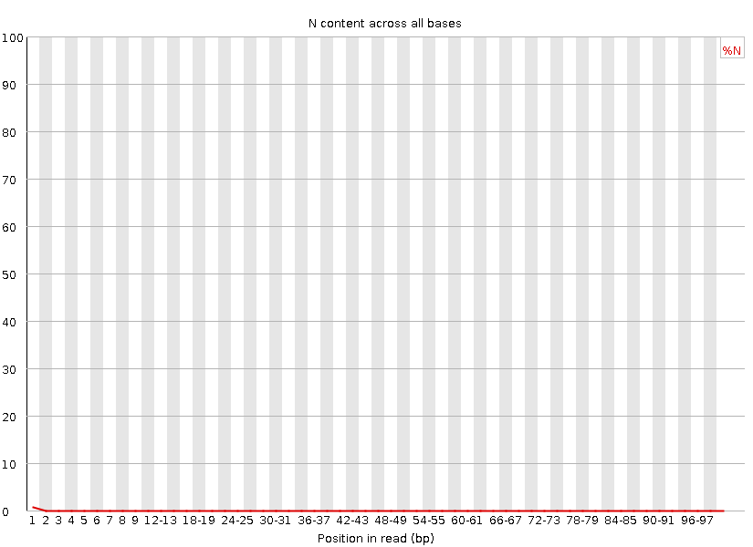

```{r setup, include=FALSE, message = FALSE, warning=FALSE}
knitr::opts_chunk$set(echo = FALSE)
library(tidyverse)
library(tinytex)
```

# Only 1 set of files was given for analysis
Kaitlyn L       4_2C_mbnl_S4_L008       4_2C_mbnl_S4_L008

## Part 1 - Read quality score distributions
### FastQC Results

1. Using ```FastQC``` via the command line on Talapas, produce plots of quality score distributions for R1 and R2 reads. Also, produce plots of the per-base N content, and comment on whether or not they are consistent with the quality score plots.

```{r out.width="80%", fig.align="center", fig.cap="Per Base N Content of R1"}
knitr::include_graphics("fastqc_results/4_2C_mbnl_S4_L008_R1_001_fastqc/Images/per_base_n_content.png")
```

```{r out.width="80%", fig.align="center", fig.cap="Per Base Quality of R1"}

```

```{r out.width="80%", fig.align="center", fig.cap="Per Base N Content of R2"}

```

```{r out.width="80%", fig.align="center", fig.cap="Per Base Quality of R2"}
knitr::include_graphics("fastqc_results/4_2C_mbnl_S4_L008_R2_001_fastqc/Images/per_base_quality.png")
```

For R1, the first several reads have a lower base quality than the rest of the reads, which is also reflected in a small lift of per base N content graph. The same goes for R2. For both R1 and R2, however, it seems as though the slight decrease in quality at the ends of the reads don't affect the per base N contents as much as they do at the start of reads. This may be due to the degradation of tail ends, from which the reads start, and the preservation of the middle portions, at which the reads end. The middle of the library is protected by the degrading ends. 

2. Run your quality score plotting script from your Demultiplexing assignment. (Make sure you're using the "running sum" strategy!!) Describe how the ```FastQC``` quality score distribution plots compare to your own. If different, propose an explanation. Also, does the runtime differ? If so, why?

```{r out.width="80%", fig.align="center", fig.cap="Python Calculated Per Base Quality of R1"}
knitr::include_graphics("4_2C_mbnl_S4_L008_R1_hist.png")
```

```{r out.width="80%", fig.align="center", fig.cap="Python Calculated Per Base Quality of R2"}

```

The FastQC quality score distribution plots look fairly similar to the quality score plotting script from Demultiplexing. However, the runtimes are very different. For FastQC, the runtime was 1:49.78 (minutes:seconds), while for the Demux script, the runtime was 11:55.70. Overall, FastQC is much faster. 

3. Comment on the overall data quality of your two libraries.

The overall data quality of the library is good, considering the lowest average quality score found in both the FastQC and Demux plots was 30. This is expected because the first couple base pairs usually have a poor quality score, and the majority of the rest of the reads have much better quality scores. 

## Part 2 – Adaptor trimming comparison

5. Using ```cutadapt```, properly trim adapter sequences from your assigned files. Be sure to read how to use ```cutadapt```. Use default settings. What proportion of reads (both R1 and R2) were trimmed?


7. Plot the trimmed read length distributions for both R1 and R2 reads (on the sampe plot). You can produce 2 different plots for your 2 different RNA-seq samples. There are a number of ways you could possibly do this. One useful thing your plot should show, for example, is whether R1s are trimmed more extensively than R2s, or vice versa. Comment on whether you expect R1s and R2s to be adapter-trimmed at different rates. 


## Part 3 – Alignment and strand-specificity

11. Demonstrate convincingly whether or not the data are from “strand-specific” RNA-Seq libraries. Include any commands/scripts used. Briefly describe your evidence, using quantitative statements (e.g. "I propose that these data are/are not strand-specific, because X% of the reads are y, as opposed to z.").


## To turn in your work for this assignment

### Upload your:
- Talapas batch script/code, 
- FastQC plots, 
- mapped/unmapped read counts, 
- counts files generated from htseq-count (in a folder would be nice), 
- answers to questions, 
- and any additional plots/code to github. 
    
### You should create a pdf file (using Rmarkdown) with a high-level report including:
- all plots
- answers to questions
- read counts (in a nicely formatted table)
    
The three parts of the assignment should be clearly labeled. Be sure to title and write a figure legend for each image/graph/table you present. The file should be named `QAA_report.pdf`, and it should be a the top level of your repo.
